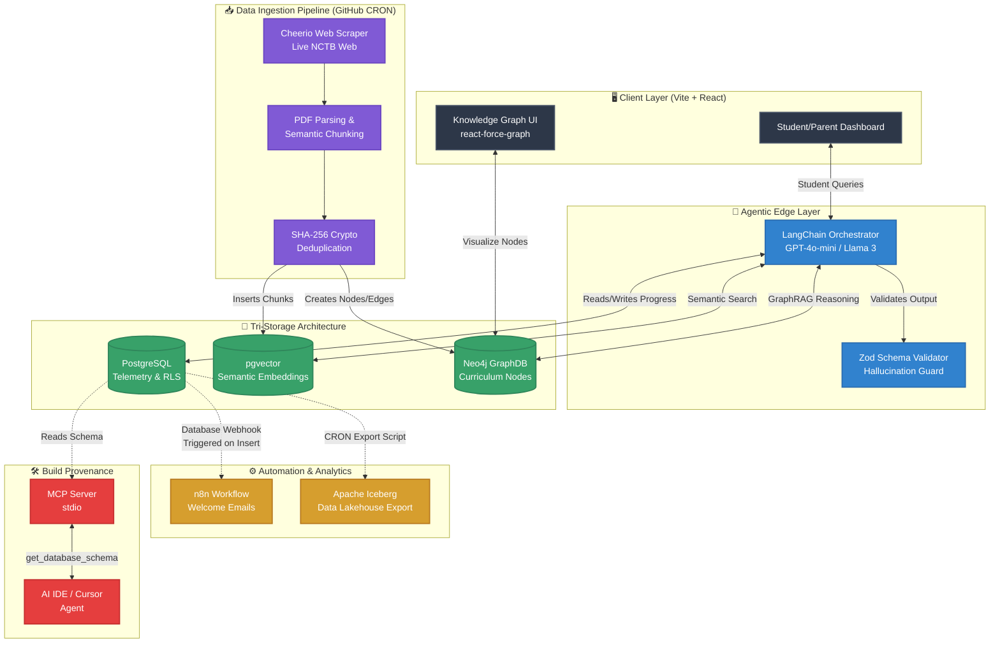

# Modern Home School Architecture

Here is the updated architectural diagram that reflects the massive upgrades we built today. 

*Note: This is written in **Mermaid**, a modern diagramming language. You can copy the code block below and paste it directly into [mermaid.live](https://mermaid.live/) to instantly generate a beautiful, downloadable PNG/SVG image for your presentation. It also renders automatically if you upload this file to GitHub!*

